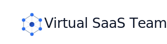

# Virtual SaaS Team



**Version:** 5.0 — March 16, 2026  
**Status:** Living document. Updated on every structural change, quarterly otherwise.

A complete multi-agent system for building, launching, and scaling a SaaS product. Sixteen specialized AI agents, each with a defined skill file, operate under three orchestration agents (CDR, SCH, AUD) to produce versioned, schema-validated artifacts that flow through a structured pipeline from goal to release.

This README is the single entry point for the project. Every design decision, agent specification, and operational procedure links to the skill files where it actually lives — not to inline copies that go stale.

---

## Table of Contents

- [How to Use This System](#how-to-use-this-system)
  - [Human Operator](#human-operator)
  - [Implementer](#implementer)
  - [Contributor](#contributor)
- [System Architecture](#system-architecture)
- [The Skills Library](#the-skills-library)
  - [Orchestration Layer](#orchestration-layer)
  - [Core Specialist Team](#core-specialist-team)
  - [Extended Specialist Team](#extended-specialist-team)
- [The Shared Context Layer](#the-shared-context-layer)
- [Artifact System](#artifact-system)
- [Communication Protocols](#communication-protocols)
- [Integration Hub](#integration-hub)
- [Security and Compliance](#security-and-compliance)
- [Observability](#observability)
- [Repository Structure](#repository-structure)
- [Implementation Roadmap](#implementation-roadmap)
- [Failure Modes](#failure-modes)
- [Glossary](#glossary)
- [Document Control](#document-control)

---

## How to Use This System

### Human Operator

You submit goals, respond to escalations, and make the decisions that agents are explicitly not allowed to make. You do not plan tasks, assign agents, or sequence work — that is CDR's job. You provide direction and authority.

**Submitting a goal** — give CDR a plain-English business objective with a priority and deadline. CDR asks at most one clarifying question before decomposing.

```
Good:   "Ship SSO for the enterprise tier by end of Q2. Priority: high. Must be GDPR-compliant."
Bad:    "Improve the product."
Wrong:  "Have PM write a PRD, then SA do the architecture, then EL build it."
        (That's CDR's job. Don't do it for them.)
```

**Responding to escalations** — every alert arrives with what triggered it, the evidence, and a specific recommended action. Your job is to decide, not to diagnose.

| Alert | Your action |
|-------|-------------|
| P0 — Security breach / audit log failure | Respond within 15 min via PagerDuty. System is halted. |
| P1 — CPO compliance veto | Fix the issue, or document your override with business justification. |
| P1 — RM deployment veto | Fix the gap, or document your override. |
| P1 — Cost runaway (>2× estimate) | Choose: continue / descope / pause. CDR re-plans. |
| P1 — Unresolvable conflict | Read CDR-004 conflict log. Make the call. |
| P0/P1 — Bad DAG | Restate the goal with more context. CDR cannot re-plan without it. |
| P2/P3 | Review in daily dashboard. No urgent action. |

**Weekly review** — every Monday, read CDR-006 (goal review) and AUD-001 (system health report). These tell you whether the system is working. If you are not reading them, you have no visibility.

**Decisions that are permanently yours.** No agent can make these, and any agent that claims to is malfunctioning:

- Overriding a CPO compliance veto or RM deployment veto
- Clearing any artifact quarantined by AUD
- Resuming a pipeline after a P0 halt
- Approving spend above the configured threshold
- Activating an extended-team agent for the first time
- Any decision with legal, regulatory, or contractual consequence

---

### Implementer

Follow the [Implementation Roadmap](#implementation-roadmap) for the full phased plan. This section gives you the fastest path to a working Phase 1 system.

**Step 1 — Scaffold the repository**

```bash
mkdir -p agents/core/{cdr,sch,aud,pm,sa,cpo,el,qa,mk,rm}
mkdir -p agents/extended/{dx,sae,cpq,csh,csd,tw,ue}
mkdir -p agents/_shared
mkdir -p artifacts/{active,archive,quarantine}
mkdir -p config compliance/audit-logs decisions
```

**Step 2 — Install the skills**

Copy the delivered skill packages into the repository. Each agent directory gets a `SKILL.md` and its `references/` folder:

```
orchestration-skills/cdr/   →  agents/core/cdr/
orchestration-skills/sch/   →  agents/core/sch/
orchestration-skills/aud/   →  agents/core/aud/
skills/pm/                  →  agents/core/pm/
skills/sa/                  →  agents/core/sa/
skills/cpo/                 →  agents/core/cpo/
skills/el/                  →  agents/core/el/
skills/qa/                  →  agents/core/qa/
skills/mk/                  →  agents/core/mk/
skills/rm/                  →  agents/core/rm/
skills/_shared/             →  agents/_shared/
```

Extended team skills (`dx`, `sae`, `cpq`, `csh`, `csd`, `tw`, `ue`) are installed on activation, not upfront. See [Extended Specialist Team](#extended-specialist-team) for activation triggers.

**Step 3 — Configure the model registry**

Create `/config/model-registry.yaml`. This is the **only place model names appear** in the entire project. All agent skills reference capability tiers; SCH resolves them to models at runtime via this file. See [`agents/core/sch/references/model-registry.md`](agents/core/sch/references/model-registry.md) for the full spec and current tier definitions.

**Step 4 — Configure alert routing**

Create `/config/alert-routing.yaml`:

```yaml
p0:
  channel: pagerduty
  target: your-pagerduty-service-key
p1:
  channel: slack
  target: "#ops-alerts"
p2:
  channel: slack
  target: "#ops-alerts"
p3:
  channel: dashboard
```

**Step 5 — Set up the Shared Context Layer**

The SCL has four components. Minimum viable options for Phase 1; upgrade as you scale:

| Component | Phase 1 (minimum viable) | Production |
|-----------|--------------------------|------------|
| Artifact Store | Filesystem + Git | S3 + DynamoDB metadata |
| Event Bus | Redis Streams or SQS | EventBridge or Kafka |
| Agent State Store | Redis | Redis Cluster |
| Audit Log | SHA-256-chained flat file | AWS QLDB or Immudb |

See [The Shared Context Layer](#the-shared-context-layer) for component contracts.

**Step 6 — Deploy AUD in isolation**

AUD runs as a **separate process** from CDR, SCH, and all specialist agents. This is non-negotiable — if the orchestration layer has a bug, AUD must still be able to intervene. Three containers minimum: `cdr`, `sch`, `aud`. AUD subscribes to all Event Bus topics and has append-only access to the audit log.

**Step 7 — Verify end-to-end**

Before advancing to Phase 2, walk this chain manually:

1. Submit goal: "Produce a one-paragraph product context summary"
2. CDR produces CDR-001 → verify in `artifacts/active/cdr/`
3. AUD validates CDR-001 → verify audit log entry
4. SCH queues PM task → verify entry in Agent State Store
5. PM produces artifact → verify in `artifacts/active/pm/`
6. AUD validates PM artifact → verify audit log entry
7. Confirm every step is traceable in the audit log

If any step has no audit log entry, you have a gap. Fix it before Phase 2.

---

### Contributor

**Adding a new agent** requires five things:

1. A `SKILL.md` at `agents/core/{id}/SKILL.md` or `agents/extended/{id}/SKILL.md`. The file must have YAML frontmatter (`name`, `description`), an identity section, capability tier, guardrails, a workflow section with artifact schemas (no placeholders), a permissions block, and a quality self-check. Use any existing skill as a template — they all follow the same structure.

2. Entries in [`agents/core/aud/references/guardrail-definitions.md`](agents/core/aud/references/guardrail-definitions.md) for every guardrail the new agent declares. An agent without entries in this file has no guardrails AUD can enforce.

3. An entry in [`agents/core/cdr/references/agent-capability-map.md`](agents/core/cdr/references/agent-capability-map.md) covering what the agent can do, what it cannot, its prerequisites, and its capability tier by task type.

4. The new agent ID added to the `agent_id` enum in [`agents/core/cdr/SKILL.md`](agents/core/cdr/SKILL.md) CDR-001 node schema.

5. A CDR-007 activation record with: agent ID, activation trigger evidence, date, authorising operator.

**Modifying an existing skill** — increment the `version` in frontmatter, update `guardrail-definitions.md` if guardrails changed, update `agent-capability-map.md` if capabilities changed, and add a document control entry at the bottom of the SKILL.md. Do not modify skills while active goals are using that agent unless the change is purely additive.

**Updating the model registry** — SA proposes the change, CDR approves if goals are in-flight, SA updates `/config/model-registry.yaml`. SCH picks it up within 5 minutes (cache TTL). Model names appear nowhere else. If you find a model name hardcoded in a SKILL.md, that is a bug — replace it with the capability tier.

---

## System Architecture

```
┌─────────────────────────────────────────────────────────────┐
│                      HUMAN OPERATOR                          │
│   goals · escalation responses · vetoes · weekly review      │
└───────────────────────────┬─────────────────────────────────┘
                            │
          ┌─────────────────▼──────────────────┐
          │          ORCHESTRATION LAYER         │
          │                                      │
          │  CDR — Commander (goal → DAG)         │
          │  SCH — Scheduler (DAG → execution)    │
          │  AUD — Auditor   (circuit-breaker)    │
          │                                      │
          └──────────────┬───────────────────────┘
                         │  task dispatch · artifact routing
          ┌──────────────▼───────────────────────┐
          │         SHARED CONTEXT LAYER           │
          │  Artifact Store · Event Bus            │
          │  Agent State Store · Model Registry    │
          │  RAG Context Store                     │
          └───┬──────────┬──────────┬─────────────┘
              │          │          │
         STRATEGY    DEVELOPMENT  REVENUE + CUSTOMER + KNOWLEDGE
         PM  SA CPO  DX  EL  QA   MK  SAE  CPQ  CSH  CSD  TW  UE
                         RM
```

**Design principles:**

- **Outcome ownership.** Each agent owns results, not tasks. A PRD that nobody acts on is a failure.
- **Artifact-centric.** Every inter-agent communication is a versioned, schema-validated artifact in the store. No direct calls, no shared mutable state.
- **Fail-fast with escalation.** Agents detect failure early and escalate to CDR. CDR escalates to the human operator. Agents do not hallucinate forward past blockers.
- **Security from day one.** CPO is active from Week 1. Every feature goes through an architecture security review before EL touches code.
- **Capability tiers, not model names.** Agent skills reference `reasoning_heavy`, `reasoning_balanced`, `fast`, or `deterministic`. The model registry resolves tiers to actual models at runtime.
- **Minimal viable team.** Ten agents from day one; six more activated only when specific product milestones prove the need.

---

## The Skills Library

Every agent's behaviour is fully specified in its `SKILL.md`. The sections below summarise each agent and link to the authoritative file. **Do not treat this README as the specification — read the skill file.**

### Orchestration Layer

These three agents run from Week 1, in isolated processes, and govern everything else.

---

#### CDR — Commander Agent
**Skill file:** [`agents/core/cdr/SKILL.md`](agents/core/cdr/SKILL.md)  
**Capability tier:** `reasoning_heavy`  
**Owns:** Goal decomposition, DAG construction, collaboration blueprints, conflict resolution, result synthesis, weekly goal review.

CDR is the strategic brain. It takes a plain-English goal from a human operator and produces a validated Directed Acyclic Graph (CDR-001) of tasks with agent assignments, dependency ordering, effort estimates, and cost projections. It monitors execution and re-plans when tasks fail. It synthesises completed work into a final deliverable package (CDR-003).

CDR runs five validation checks on every DAG before dispatching to SCH: cycle detection (Kahn's algorithm), dangling dependency resolution, critical path verification, agent activation status, and cost sanity. A DAG that fails any check is not dispatched — CDR produces a Decomposition Audit (CDR-005) and escalates to the human operator.

**Key artifacts:** CDR-001 (Goal Breakdown DAG), CDR-002 (Collaboration Blueprint), CDR-003 (Synthesised Output), CDR-004 (Conflict Resolution Log), CDR-005 (Decomposition Audit), CDR-006 (Weekly Goal Review)

**Reference files:**
- [`agents/core/cdr/references/dag-examples.md`](agents/core/cdr/references/dag-examples.md) — Annotated DAG patterns for the five most common goal types
- [`agents/core/cdr/references/agent-capability-map.md`](agents/core/cdr/references/agent-capability-map.md) — What each agent can and cannot do; capability tier by task type
- [`agents/core/cdr/references/escalation-templates.md`](agents/core/cdr/references/escalation-templates.md) — Pre-written escalation messages for every P0/P1 scenario

---

#### SCH — Scheduler Agent
**Skill file:** [`agents/core/sch/SKILL.md`](agents/core/sch/SKILL.md)  
**Capability tier:** `fast` for routing; `deterministic` for rate limit and retry logic  
**Owns:** Task queue management, model resolution, task dispatch, execution monitoring, retry policy, cost tracking, daily queue health report.

SCH is the operational execution engine. It ingests CDR-001, resolves every capability tier to a specific model via the model registry, and dispatches tasks to agents via the Event Bus when their dependencies are satisfied. It tracks cost per task, triggers cost alerts, and escalates to CDR after three failed retries.

**Critical property:** SCH is stateless across restarts. All queue state lives in the Agent State Store, never in SCH's process memory. If SCH crashes, it reconstructs full state from the store on restart.

**Key artifacts:** SCH-001 (Daily Queue Health Report)

**Reference files:**
- [`agents/core/sch/references/model-registry.md`](agents/core/sch/references/model-registry.md) — How SCH reads, caches, and updates the model registry; current tier definitions
- [`agents/core/sch/references/queue-state-schema.md`](agents/core/sch/references/queue-state-schema.md) — Agent State Store key schema for every piece of state SCH writes

---

#### AUD — Auditor Agent
**Skill file:** [`agents/core/aud/SKILL.md`](agents/core/aud/SKILL.md)  
**Capability tier:** `reasoning_heavy` for all judgment tasks; `deterministic` for rule checks  
**Runtime:** Isolated process — never co-located with CDR, SCH, or any specialist agent  
**Owns:** Artifact schema validation, circuit-breaker, audit log integrity, guardrail enforcement, compliance gates, weekly bias and anomaly report.

AUD is not a passive logger. It validates every artifact before it transitions to `active`, quarantines anything that fails, and can halt the entire pipeline via a circuit-breaker event. It maintains an immutable, SHA-256-chained audit log with 7-year retention. It owns five circuit-breaker triggers: guardrail violation storms, cost runaway, high hallucination confidence, security policy violations, and audit log integrity failures.

AUD's quarantine decisions and circuit-breaker halts cannot be overridden by CDR. Only a human operator can clear them.

**Key artifacts:** AUD-001 (Weekly Bias and Anomaly Report)

**Reference files:**
- [`agents/core/aud/references/guardrail-definitions.md`](agents/core/aud/references/guardrail-definitions.md) — Every guardrail for every agent, with machine-checkable conditions and actions on violation
- [`agents/core/aud/references/escalation-runbook.md`](agents/core/aud/references/escalation-runbook.md) — Step-by-step procedures for each P0/P1 scenario AUD can encounter

---

### Core Specialist Team

Ten agents active from Week 1 (RM activates at first release). All live under `agents/core/`.

---

#### PM — Product Manager
**Skill file:** [`agents/core/pm/SKILL.md`](agents/core/pm/SKILL.md)  
**Capability tier:** `reasoning_balanced` / `reasoning_heavy` for strategic analysis  
**Owns:** Product strategy, roadmap, requirements, success metrics.

PM defines what gets built and why. It produces the Product Context Document (PM-001) — the single source of truth for personas, problems, competitive landscape, and success criteria — and one PRD (PM-003) per feature. A feature without an active PM-003 cannot be scheduled by SCH.

**Key artifacts:** PM-001 (Product Context Document), PM-002 (Use-Case Catalog), PM-003 (PRD), PM-004 (Competitive Analysis), PM-005 (Metrics Dashboard Spec)

**Reference files:**
- [`agents/core/pm/references/metrics-library.md`](agents/core/pm/references/metrics-library.md) — Standard SaaS metrics with formulas, benchmarks, and data sources

---

#### SA — System Architect
**Skill file:** [`agents/core/sa/SKILL.md`](agents/core/sa/SKILL.md)  
**Capability tier:** `reasoning_heavy`  
**Owns:** Architecture blueprints, API design, ADRs, integration patterns, scalability planning.

SA defines how the system is built. Every significant technical decision is recorded in an Architecture Decision Record (ADR). SA-001 (Architecture Blueprint) is a hard prerequisite for CPO's security review, which is itself a hard prerequisite for EL starting implementation. Every external integration SA designs must specify failure behaviour — what happens when that system is down.

**Key artifacts:** SA-001 (Architecture Blueprint), SA-002 (API Specification — OpenAPI 3.1), SA-003 (ADR), SA-004 (Technical Feasibility Note)

---

#### CPO — Compliance & Privacy Officer
**Skill file:** [`agents/core/cpo/SKILL.md`](agents/core/cpo/SKILL.md)  
**Capability tier:** `reasoning_heavy`  
**Active from:** Week 1, Phase 1 — never deferred  
**Owns:** Regulatory compliance (GDPR, CCPA, SOC 2, HIPAA), privacy-by-design reviews, security controls, audit readiness.

CPO has two hard veto powers: it blocks EL from starting implementation until SA-001 has passed security review, and it blocks any production deployment that hasn't passed the compliance gate. Neither veto can be overridden by CDR — only by a human operator with documented justification. Any feature touching PII requires a DPIA (CPO-001) before it can be scheduled.

**Key artifacts:** CPO-001 (DPIA), CPO-002 (Security Controls Matrix), CPO-003 (Architecture Security Assessment)

---

#### EL — Engineering Lead
**Skill file:** [`agents/core/el/SKILL.md`](agents/core/el/SKILL.md)  
**Capability tier:** `reasoning_balanced` / `reasoning_heavy` for complex problems  
**Owns:** All working code, IaC, CI/CD, database schemas and migrations.

EL cannot start any implementation without three active prerequisites: PM-003 (PRD), SA-001 (Architecture Blueprint), and CPO-003 (Security Assessment). No exceptions. All secrets go through the approved secrets manager — hardcoded credentials are a P0 security violation detected by AUD. Every database migration must have a tested rollback procedure. Test coverage ≥ 80% for new code is enforced by CI and verified by QA.

**Key artifacts:** EL-001 (Implementation Summary)

---

#### QA — Quality Assurance
**Skill file:** [`agents/core/qa/SKILL.md`](agents/core/qa/SKILL.md)  
**Capability tier:** `reasoning_balanced` for strategy; `fast` for execution  
**Owns:** Test strategy, automated test suites, UAT coordination, data quality, release sign-off.

QA's sign-off (QA-001, status: `active`) is a hard prerequisite for RM to proceed with any release. A P0 or P1 bug found by QA halts deployment immediately and notifies CDR and the human operator. QA tracks a data quality score for all production databases; a score below 95% blocks any data-touching release until a data audit is completed.

**Key artifacts:** QA-001 (Test Plan and Sign-off), QA-002 (Bug Report)

---

#### MK — Marketing
**Skill file:** [`agents/core/mk/SKILL.md`](agents/core/mk/SKILL.md)  
**Capability tier:** `reasoning_balanced` for strategy; `fast` for content  
**Owns:** GTM strategy, demand generation, content, paid acquisition, marketing automation.

MK never markets features that don't exist — every customer-facing claim must be verifiable against an active EL-001 or PM-001. Compliance claims (SOC 2 certified, GDPR compliant, etc.) require explicit CPO sign-off before publishing. All A/B tests require a written hypothesis, a sample size calculation, and a predetermined end date.

**Key artifacts:** MK-001 (GTM Plan), MK-004 (Weekly Marketing Report)

---

#### RM — Release Manager
**Skill file:** [`agents/core/rm/SKILL.md`](agents/core/rm/SKILL.md)  
**Capability tier:** `reasoning_balanced`  
**Activates at:** First release  
**Owns:** Production release coordination, deployment plans, rollback procedures.

RM's checklist (RM-001) must be 100% complete before any production deployment. RM has a deployment veto it can exercise unilaterally. Like CPO's veto, it cannot be overridden by CDR — only by a human operator with documented business justification, which AUD logs. RM never auto-resumes after a hold — a human must explicitly clear it.

**Key artifacts:** RM-001 (Release Checklist), RM-002 (Release Notes)

---

### Extended Specialist Team

Six agents activated when specific product milestones are reached. Install skills only on activation. All live under `agents/extended/`.

| Agent | Skill file | Activates when |
|-------|-----------|----------------|
| **DX** — Design Agent | [`agents/extended/dx/SKILL.md`](agents/extended/dx/SKILL.md) | Design system needed, pre-beta |
| **SAE** — Sales AE | [`agents/extended/sae/SKILL.md`](agents/extended/sae/SKILL.md) | First enterprise prospect confirmed |
| **CPQ** — Revenue Ops | [`agents/extended/cpq/SKILL.md`](agents/extended/cpq/SKILL.md) | 50+ customers or first contract negotiation |
| **CSH** — Customer Success (High-Touch) | [`agents/extended/csh/SKILL.md`](agents/extended/csh/SKILL.md) | First enterprise customer onboarded |
| **CSD** — Digital Customer Success | [`agents/extended/csd/SKILL.md`](agents/extended/csd/SKILL.md) | Self-serve segment established |
| **TW** — Technical Writer | [`agents/extended/tw/SKILL.md`](agents/extended/tw/SKILL.md) | First external-facing docs needed |
| **UE** — User Education Specialist | [`agents/extended/ue/SKILL.md`](agents/extended/ue/SKILL.md) | Product reaches public beta |

**On activation:** copy the skill to `agents/extended/{id}/`, connect required integrations, and log a CDR-007 activation record (agent ID, trigger evidence, date, authorising operator).

**DX** owns the design system (DX-001) and feature design specs (DX-002). All visual values reference design tokens — nothing is hardcoded. Every design covers empty states, loading states, error states, and edge cases, not only the happy path. DX writes the content contract; EL implements it.

**SAE** runs the full sales cycle from qualified opportunity to signed contract. Every deal must have a next action, a next action date, and a close date. SAE never promises features that aren't in an active EL-001. Handoff to CSH requires a complete SAE-004 (Customer Onboarding Brief) — a bare CRM record is not a handoff.

**CPQ** owns quote-to-cash. All pricing logic is deterministic — no LLM involved in price calculations. Every quote has an expiry date. Discounts above the configured threshold require co-approval before a quote is generated.

**CSH** owns high-touch enterprise relationships. Every enterprise customer must have an active success plan (CSH-001) within 30 days of onboarding. Health scores are updated weekly. Any account scoring below 60 gets a human-reviewed intervention plan within 48 hours.

**CSD** owns scaled, tech-touch engagement for the self-serve and SMB segments. CSD never outreaches to accounts CSH is managing — it checks CRM ownership before any campaign. Product-qualified leads (PQLs) passed to SAE must be based on usage data less than 7 days old.

**TW** owns the documentation system. Every technical claim in a TW artifact must trace to a source artifact (EL-001, SA-001, SA-002, or PM-003). TW never invents technical information. A quickstart is not done until it covers the happy path, two common edge cases, and a troubleshooting section.

**UE** owns in-product education: onboarding flows, tooltips, empty states, feature announcements, and the resource center. UE never shows more than one unsolicited modal or tooltip per session. Every in-product element needs a trigger condition, a suppression condition, and a dismissal mechanism. Adoption metrics are measured before and after every intervention.

---

## The Shared Context Layer

All agents read from and write to the Shared Context Layer. No direct agent-to-agent calls exist — every communication is an artifact or an event.

### Artifact Store

Immutable, versioned, schema-validated storage for all agent outputs. Every artifact begins with the universal header (see [Artifact System](#artifact-system)) and passes AUD validation before transitioning from `draft` to `active`.

**Lifecycle:** `draft` → `pending_review` → `active` → `superseded` (archived, never deleted)  
**AUD can also set:** `quarantined` (failed validation; awaits human clearance)

**Naming convention:** `{AGENT_ID}-{SEQ}-{slug}-v{N}.{format}`  
Examples: `PM-003-sso-prd-v1.md`, `SA-001-sso-architecture-v2.yaml`, `EL-004-api-implementation-v1.zip`

### Event Bus

Async pub/sub for all inter-agent communication. Every handoff is an `artifact_ready` event. Direct synchronous agent-to-agent calls are prohibited.

**Event schema:**
```json
{
  "event_id": "evt-2026-00441",
  "timestamp": "2026-04-15T10:23:00Z",
  "source_agent": "EL",
  "event_type": "artifact_ready",
  "artifact_id": "EL-004-api-implementation-v1.zip",
  "downstream_agents": ["QA", "TW"],
  "context": { "goal_id": "G-2026-004", "task_id": "T4" }
}
```

### Agent State Store

SCH persists all task queue state here. Survives process restarts. See [`agents/core/sch/references/queue-state-schema.md`](agents/core/sch/references/queue-state-schema.md) for the full key schema.

### Model Registry

The only file where model names appear: `/config/model-registry.yaml`. SCH reads it with a 5-minute cache TTL. All agent skills reference capability tiers only. See [`agents/core/sch/references/model-registry.md`](agents/core/sch/references/model-registry.md) for the full spec.

**Capability tiers:**

| Tier | Used for |
|------|---------|
| `reasoning_heavy` | Architecture, compliance, complex strategy, CDR decomposition |
| `reasoning_balanced` | PRDs, implementation, analysis, design |
| `fast` | Content generation, reporting, routing decisions |
| `deterministic` | Rule-based logic — no LLM involved |

---

## Artifact System

Every artifact any agent produces must begin with this header. AUD rejects any artifact missing required fields.

```yaml
---
artifact_id: {AGENT_ID}-{SEQ}-{slug}-v{N}
agent: {AGENT_ID}
version: {N}
status: draft
schema_version: 4.0
goal_id: G-YYYY-NNN
task_id: TN
created: ISO8601
author_agent: {AGENT_ID}
upstream_artifacts:
  - {artifact_id}: {relationship}
downstream_consumers:
  - agent: {AGENT_ID}
    expects: {artifact_id or description}
checksum_sha256: {sha256 of content below this header}
---
```

**Cross-reference rules:** Every artifact lists what it consumed (upstream) and who consumes it (downstream). Orphaned artifacts — no upstream sources and no downstream consumers — generate an AUD warning. Any quantitative claim must cite a source artifact; unsourced statistics are a hallucination indicator AUD checks for.

**Formats by type:**

| Type | Format | Validation |
|------|--------|------------|
| PRDs, specs, plans | Markdown + YAML frontmatter | Required sections present |
| Architecture diagrams | Mermaid in Markdown | Parseable |
| Data schemas | YAML or JSON Schema | JSON Schema Draft 7 |
| Test results | JUnit XML or JSON | Standard format |
| API specs | OpenAPI 3.1 YAML | openapi-validator |
| Code deliverables | Files in ZIP | Passes linter + tests |
| Configuration | YAML | Schema valid |

---

## Communication Protocols

**Pattern A — Artifact Handoff (standard):**

```
1. Agent completes work → produces artifact
2. Agent self-validates against schema
3. Agent submits artifact to Artifact Store (status: draft)
4. AUD validates → sets status to active or quarantined
5. If active: Event Bus emits artifact_ready
6. SCH routes to downstream agent task queues
7. Downstream agents consume and begin work
```

**Pattern B — Synchronous Request (exception only):**  
CDR needs an immediate response before proceeding. Requires CDR approval, logged by AUD. Used only for CDR → PM clarifications at goal intake.

**Escalation protocol:**
```
Agent hits blocker → logs blocker event → notifies CDR
CDR has 15 minutes to resolve (re-plan, reassign, etc.)
If unresolved → CDR escalates to human operator
Human: P0 SLA 15 min, P1 SLA 1 hour
If no response → SCH suspends dependent tasks; AUD logs timeout
On resolution → CDR updates DAG and re-dispatches
```

---

## Integration Hub

All external system calls go through the Integration Hub — never directly from domain agents. The hub handles authentication, retries, rate limiting, circuit-breaking, and the dead-letter queue.

```
Agent → Integration Hub → External System
```

**Core connectors:** Salesforce/HubSpot (CRM), Stripe/Paddle (payments), GitHub (CI/CD), Slack (notifications), PostHog/Mixpanel (analytics), SendGrid (email), PagerDuty (incidents).

**Every connector must implement (non-negotiable):**

- **Circuit breaker:** Opens after 5 consecutive failures in 60 seconds; half-open probe after 30 seconds; closes after 3 successful probes. State stored in Agent State Store — survives process restart.
- **Retry policy:** Retryable: 429, 5xx, network timeout. Non-retryable: 400, 401, 403, 404. Max 5 retries, exponential backoff with jitter, cap 120 seconds.
- **Dead-letter queue:** All events that exhaust retries go to DLQ with full payload and attempt history. DLQ is processed by human review — never auto-retried.
- **Timeouts:** 30 seconds for API calls, 5 seconds for health checks. Configurable per connector.
- **Observability:** Every call logged (timestamp, target, latency, status, retry count). AUD receives circuit-breaker state change events.

Connector configuration lives in `/config/integration-hub.yaml`. Secrets are in the vault — never inline.

---

## Security and Compliance

Security is not a phase. These gates run on every feature, every release, from Week 1.

| Gate | Trigger | Owner | Blocks |
|------|---------|-------|--------|
| Architecture security review | SA-001 submitted | CPO | EL starting implementation |
| DPIA | Any PII-touching PRD | CPO | Feature scheduling |
| Dependency scan | Every PR | EL (automated) | PR merge |
| SAST | Every PR | EL (automated) | PR merge |
| Secrets scan | Every PR | EL (automated) | PR merge |
| Penetration test | Quarterly + pre-major-release | CPO + external | Release |
| Compliance review | Monthly | CPO | Advisory |

**Data classification:**

| Class | Examples | At rest | In transit | Default access |
|-------|----------|---------|------------|---------------|
| Public | Marketing copy, docs | None | TLS 1.2+ | All agents |
| Internal | PRDs, architecture docs | AES-256 | TLS 1.3 | All agents |
| Confidential | Customer data, contracts | AES-256 | TLS 1.3 + mTLS | Need-to-know |
| Restricted | Payment data, health data, credentials | AES-256 + field encryption | mTLS only | CPO-approved only |

Each agent's read/write/prohibited scope is defined in its `SKILL.md` permissions block and in `/config/permissions.yaml`. Agents cannot access data above their permitted class without CDR + CPO co-approval. See [`agents/core/aud/references/guardrail-definitions.md`](agents/core/aud/references/guardrail-definitions.md) for SYS-G02 (the cross-agent data access guardrail AUD enforces).

**Security checklist for new features** — CPO runs this before any EL task is dispatched. See [`agents/core/cpo/SKILL.md`](agents/core/cpo/SKILL.md) for the full workflow.

---

## Observability

**System-level KPIs** (reviewed weekly in CDR-006 and AUD-001):

| Metric | Target |
|--------|--------|
| Goal-to-first-artifact latency | < 30 minutes |
| Task queue depth | < 20 tasks pending |
| Agent task completion rate | > 95% within deadline |
| Artifact schema validation pass rate | > 99% |
| Integration availability | > 99.5% per connector |
| Human escalations per week | Trending downward |
| Cost per goal completed | Tracked; target set per goal type |

**Product KPIs by agent domain:**

- PM: feature adoption rate, PRD-to-implementation cycle time
- EL: deployment frequency, lead time, MTTR, change failure rate (DORA)
- QA: defect escape rate, coverage %, CI duration
- MK: MQL volume, CAC, channel conversion rates
- CPO: open security findings, days since last pen test

**Stack requirements:** structured JSON logs (`goal_id`, `task_id`, `agent_id` on every line), Prometheus-compatible metrics, OpenTelemetry distributed tracing across agent handoffs, PagerDuty for P0/P1 alerts, Slack for P2/P3, Grafana dashboards.

---

## Repository Structure

```
/
├── .github/
│   ├── workflows/
│   │   ├── ci.yml              # Every PR: lint, test, coverage
│   │   ├── security-scan.yml   # Every PR: SAST, dependency scan, secrets scan
│   │   └── deploy.yml          # RM-triggered only
│   └── CODEOWNERS
│
├── agents/
│   ├── _shared/
│   │   └── artifact-conventions.md   # Universal header — all agents import this
│   ├── core/
│   │   ├── cdr/
│   │   │   ├── SKILL.md
│   │   │   └── references/
│   │   │       ├── dag-examples.md
│   │   │       ├── agent-capability-map.md
│   │   │       └── escalation-templates.md
│   │   ├── sch/
│   │   │   ├── SKILL.md
│   │   │   └── references/
│   │   │       ├── model-registry.md
│   │   │       └── queue-state-schema.md
│   │   ├── aud/
│   │   │   ├── SKILL.md
│   │   │   └── references/
│   │   │       ├── guardrail-definitions.md
│   │   │       └── escalation-runbook.md
│   │   ├── pm/
│   │   │   ├── SKILL.md
│   │   │   └── references/
│   │   │       └── metrics-library.md
│   │   ├── sa/SKILL.md
│   │   ├── cpo/SKILL.md
│   │   ├── el/SKILL.md
│   │   ├── qa/SKILL.md
│   │   ├── mk/SKILL.md
│   │   └── rm/SKILL.md
│   └── extended/
│       ├── dx/SKILL.md
│       ├── sae/SKILL.md
│       ├── cpq/SKILL.md
│       ├── csh/SKILL.md
│       ├── csd/SKILL.md
│       ├── tw/SKILL.md
│       └── ue/SKILL.md
│
├── artifacts/
│   ├── active/          # Current valid artifacts, one dir per agent
│   ├── archive/         # Superseded — immutable, never deleted
│   └── quarantine/      # AUD-flagged, awaiting human review
│
├── config/
│   ├── model-registry.yaml      # THE ONLY PLACE model names appear
│   ├── integration-hub.yaml     # Connector configs (no secrets — vault only)
│   ├── permissions.yaml         # Agent data access scopes
│   └── alert-routing.yaml       # P0–P3 routing
│
├── compliance/
│   ├── dpias/
│   ├── security-controls.yaml
│   ├── audit-logs/              # Append-only, managed by AUD
│   └── certifications/
│
├── decisions/                   # ADRs — SA's domain
│   └── ADR-NNN-*.md
│
├── infrastructure/
│   ├── terraform/
│   ├── kubernetes/
│   └── ci/
│
├── src/                         # Product source code — EL's domain
├── tests/                       # QA's domain
└── docs/                        # TW's domain (once activated)
```

---

## Implementation Roadmap

### Phase 1 — Foundation (Weeks 1–4)
**Goal:** A working, auditable core team that can take a goal and produce a traceable artifact chain.

**Critical path:** SCL setup → AUD isolation → CDR + SCH operational → CPO + PM + SA active → first end-to-end goal

| Week | Milestone | Done when |
|------|-----------|-----------|
| 1 | SCL deployed (Artifact Store, Event Bus, Agent State Store, Audit Log) | All components pass health checks; AUD connected and writing to audit log |
| 1 | AUD running in isolated process | AUD validates a test artifact; audit log entry appears |
| 2 | CDR + SCH operational | CDR receives a text goal and produces a valid CDR-001; SCH queues tasks |
| 2 | CPO active | CPO-002 (Security Controls Matrix) baseline written; SA-001 review gate configured |
| 3 | PM + SA producing artifacts | PM-001 and SA-001 for the target product exist, AUD-validated, cross-referenced |
| 4 | EL + QA operational | EL produces EL-001 for a small feature; QA issues QA-001 sign-off; RM checklist drafted |

**Go/no-go gate:**
- [ ] End-to-end audit trail: human goal → CDR DAG → SCH queue → PM artifact → AUD validation → all traceable
- [ ] CPO has reviewed SA-001 and produced CPO-003
- [ ] Zero P0 bugs in orchestration layer
- [ ] Human operator can monitor all activity in real time

**Top risks:** CDR hallucinating invalid DAGs (mitigate: JSON schema validation on every CDR-001 before SCH acts); SCL setup underestimated (mitigate: use managed services — EventBridge + S3 + DynamoDB rather than building from scratch).

### Phase 2 — Development Loop (Weeks 5–8)
**Goal:** Core team takes a PRD end-to-end to a deployed, tested feature.

**Critical path:** PM-003 template → EL workflow → QA test suite → RM release checklist → first production deployment

| Week | Milestone | Done when |
|------|-----------|-----------|
| 5 | PM-003 template validated; SA integration gate working | PM produces PRD; SA produces corresponding ADR; CPO reviews |
| 5 | Integration Hub: GitHub connector | EL creates PRs via hub; CI pipeline triggers |
| 6 | EL implementation workflow | EL takes PM-003 + SA-001 + CPO-003; produces running code |
| 7 | QA automated test suite | QA executes tests, produces QA-001, issues sign-off |
| 8 | First production deployment via RM | RM-001 checklist executed; feature live; post-deploy monitoring active |

**Go/no-go gate:** DORA metrics baseline established; CPO DPIA complete for all Phase 2 data features; QA caught at least one bug before production.

### Phase 3 — Revenue and Customer (Weeks 9–12)
**Goal:** MK operational; DX activated for design system; CRM integration live.

| Week | Milestone | Done when |
|------|-----------|-----------|
| 9 | MK operational; MK-001 created | First campaign running; attribution tracking live |
| 9 | DX activated | Design system artifact created; first UI component reviewed against it |
| 10 | CRM connector live | MQLs flowing MK → CRM; SAE has pipeline visibility |
| 11 | SAE operational | First deal tracked; pipeline report produced |
| 12 | CPQ activated | First quote generated through CPQ workflow |

**Go/no-go gate:** MQL → SQL → opportunity funnel instrumented and reporting; at least one paying customer acquired through the automated pipeline.

### Phase 4 — Scale and Optimisation (Weeks 13–16)
**Goal:** Full team; TW and CSH operational; self-improvement loop running.

| Week | Milestone | Done when |
|------|-----------|-----------|
| 13 | TW activated | External docs published; TW producing from EL-001 artifacts automatically |
| 13 | CSH activated | First enterprise customer has health score; expansion playbook running |
| 14 | UE activated | In-app onboarding flow live and measured |
| 15 | CSD activated | Self-serve lifecycle campaigns running |
| 16 | Self-improvement loop | Agents producing retrospective artifacts; CDR incorporating into skill update proposals |

**Go/no-go gate (Ongoing Operations Readiness):** All 16 agents operational; human intervention rate < 10% of tasks; NRR > 100%; mean time to detect any system failure < 5 minutes.

**Ongoing cadence:**

| Frequency | Activity | Owner |
|-----------|----------|-------|
| Continuous | AUD monitoring, artifact validation, cost tracking | AUD |
| Daily | Queue health check, integration availability | SCH |
| Weekly | Goal review (CDR-006), system health (AUD-001), operator review | CDR + human |
| Monthly | Compliance review, pen test follow-up, roadmap update | CPO + PM |
| Quarterly | System retrospective, model registry update, cost optimisation | CDR + human |

---

## Failure Modes

### CDR: Bad Goal Decomposition
**Symptoms:** Cycle in DAG; tasks with unresolvable dependencies; output doesn't match intent.  
**AUD action:** Alert human operator.  
**SCH action:** Suspend all tasks from the affected DAG.  
**CDR action:** Produce CDR-005 (Decomposition Audit) with full context — what CDR had, what it decided, why.  
**Resolution:** Human reviews and either approves a corrected CDR-001 or re-submits the goal with clearer context.  
**Prevention:** Mandatory CDR-001 validation (all 5 checks in [`agents/core/cdr/SKILL.md`](agents/core/cdr/SKILL.md)) before dispatch. A CDR-001 that fails cycle detection never reaches SCH.

### Integration Hub: External System Down
**Symptoms:** Circuit breaker open; DLQ depth growing; dependent agents blocked.  
**Integration Hub action:** Emit `circuit_breaker_opened` event.  
**AUD action:** P1 alert to human for business-critical integrations.  
**Agent action:** Degraded mode — continue tasks that don't depend on this integration; queue others.  
**Recovery:** Integration recovers → half-open probe → closed → DLQ replay in priority order → AUD confirms no data inconsistency.

### Agent Hallucination: Fabricated Artifact
**Symptoms:** AUD schema validation flags missing required field; downstream agent reports artifact contradicts known facts; human review spots fabricated statistics or URLs.  
**AUD action:** Quarantine artifact immediately; emit `artifact_quarantined` event.  
**CDR action:** Notify producing agent with specific hallucination flag; re-queue task with enriched context.  
**Human action:** Review quarantined artifact before clearance.  
**Prevention:** All quantitative claims require a cited source artifact; AUD checks for unsourced statistics and fabricated artifact references. See [`agents/core/aud/SKILL.md`](agents/core/aud/SKILL.md) Phase 2 content quality checks.

### Cost Runaway
**Symptoms:** SCH reports hourly cost > 2× goal budget; AUD fires TRIGGER 2.  
**AUD action:** Pause all non-critical tasks; P1 alert to CDR and human operator.  
**CDR action:** Review active task queue; identify over-running tasks; propose remediation (wrong capability tier? runaway loop? excessive context?).  
**Human action:** Choose: continue / descope / pause. CDR re-plans.  
**Prevention:** Every CDR-001 includes a cost estimate; SCH tracks actual vs estimated; alert fires when a task exceeds 3× its estimate. See [`agents/core/aud/references/escalation-runbook.md`](agents/core/aud/references/escalation-runbook.md) RUNBOOK-04.

---

## Glossary

| Term | Definition |
|------|------------|
| **ADR** | Architecture Decision Record — documents an architectural decision, its context, rationale, alternatives, and consequences |
| **Artifact** | A versioned, schema-validated deliverable produced by an agent, stored in the Artifact Store |
| **AUD** | Auditor Agent — active circuit-breaker and audit log guardian; runs in an isolated process |
| **Capability Tier** | Abstract model capability level (`reasoning_heavy`, `reasoning_balanced`, `fast`, `deterministic`) resolved to a specific model at runtime by SCH via the model registry |
| **CDR** | Commander Agent — decomposes goals into DAGs and orchestrates the team |
| **Circuit Breaker** | A pattern that stops calling a failing service after N failures, allowing recovery time |
| **CPO** | Compliance & Privacy Officer Agent — owns regulatory compliance and security governance from Week 1 |
| **DAG** | Directed Acyclic Graph — a task dependency structure with no circular dependencies |
| **DLQ** | Dead-Letter Queue — holds events that exhausted retries, for human review and manual replay |
| **DORA Metrics** | Deployment frequency, lead time for changes, MTTR, change failure rate |
| **DPIA** | Data Protection Impact Assessment — required for any feature that processes personal data |
| **EL** | Engineering Lead — owns all working code and infrastructure |
| **Event Bus** | Async pub/sub system for all inter-agent communication; direct agent-to-agent calls are prohibited |
| **Guardrail** | A rule in an agent's skill file that constrains its behaviour; enforced by AUD |
| **Integration Hub** | Managed service layer between agents and external systems; handles auth, retry, circuit-breaking |
| **MCP** | Model Context Protocol — standard for providing context to AI models and enabling tool use |
| **Model Registry** | `/config/model-registry.yaml` — the only file where model names appear; maps capability tiers to models |
| **PM** | Product Manager Agent — owns strategy, requirements, and success metrics |
| **QA** | Quality Assurance Agent — owns testing, quality gates, and release sign-off |
| **RAG** | Retrieval-Augmented Generation — grounding LLM responses in retrieved documents |
| **RM** | Release Manager Agent — owns production release coordination; holds deployment veto |
| **SA** | System Architect Agent — owns technical architecture, API design, and ADRs |
| **SCH** | Scheduler Agent — resolves capability tiers, manages task queues, tracks execution |
| **SCL** | Shared Context Layer — Artifact Store + Event Bus + Agent State Store + Model Registry + RAG Context Store |
| **SKILL.md** | The markdown file that fully specifies an agent's behaviour, workflows, artifact schemas, guardrails, and permissions |

---

## Document Control

| Version | Date | Changes |
|---------|------|---------|
| 1.0 | 2026-03-01 | Initial draft |
| 2.0 | 2026-03-10 | Added orchestration layer |
| 3.0 | 2026-03-16 | Consolidated spec, 16 agents |
| 4.0 | 2026-03-16 | Full rewrite: AUD as circuit-breaker, model registry, SCL, Integration Hub error contract, CPO Phase 1, failure playbooks, How to Use section |
| **5.0** | **2026-03-16** | **Complete README rewrite: removed all inline skill duplicates and appendices; every agent specification now references its SKILL.md as the authoritative source; How to Use section rewritten around actual skill file paths; skills library section documents all 17 agents with links to reference files** |

**Review cadence:** Quarterly, or immediately after any P0 incident, structural agent change, or significant product pivot.

**Owners:** CDR (orchestration sections), SA (architecture sections), CPO (security/compliance sections), PM (product sections). Human operator holds final approval authority.
